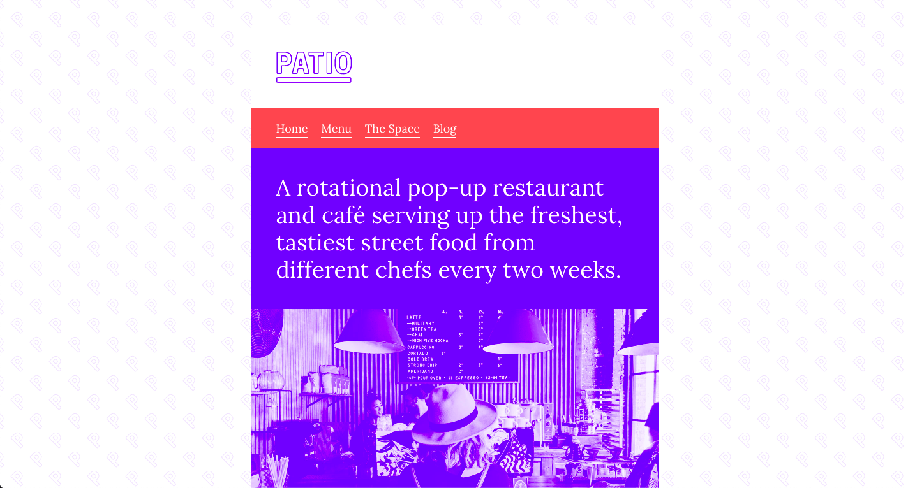
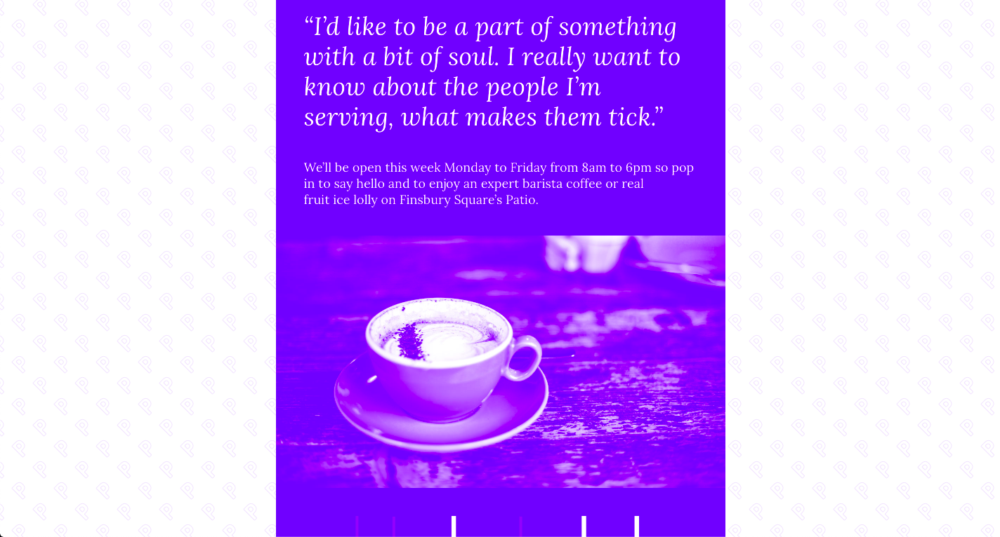
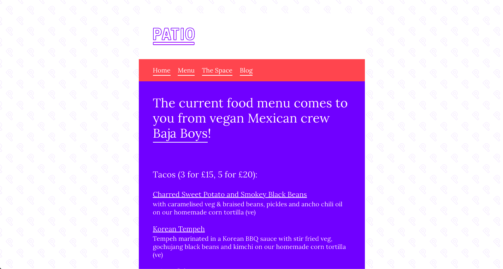
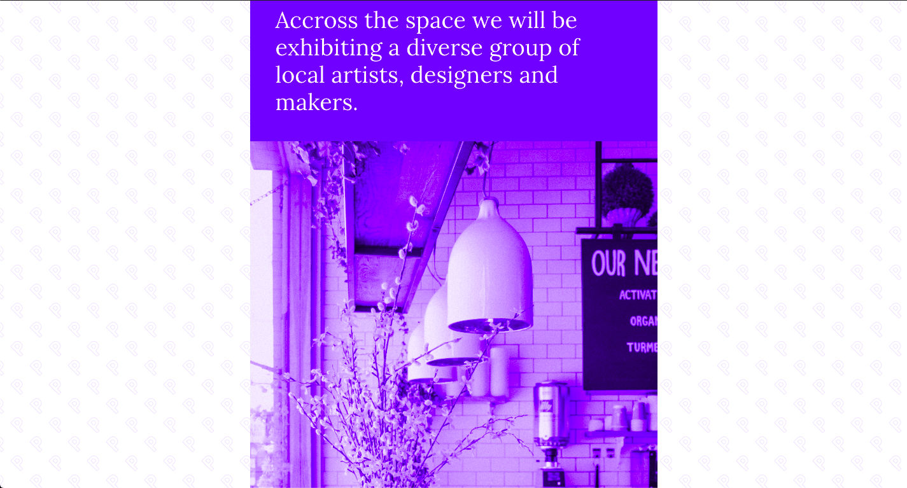

# Patio
Responsive single column website for a cafe.

## Table of contents
* [General info](#general-info)
* [Screenshots](#screenshots)
* [Technologies](#technologies)
* [Demo](#demo)
* [Features](#features)
* [Status](#status)
* [Contact](#contact)

## General info
This was the second project on the [Superhi Foundation](https://superhi.com/courses/html-css-javascript-foundation) course. It comprises of a single column website for a cafe in London. Beyond the original scope of the tutorial I added further pages and expanded the complexity of the site. This was a good extension of the knowledge I had already gained from the previous projects on the course, and was a more in depth look into media queries. 

## Screenshots

## Technologies
* HTML5
* CSS3

## Demo
[Live Demo](https://guybroadhurst.github.io/patio/)

## Features
List of features:
* Single column design with consistent layout across multiple pages.
* Responsive to smaller screen sizes.

## Status
Project is: _finished_ and complete for the course.
 
## Contact
Created by [@guybroadhurst](https://www.guybroadhurst.co.uk/) - feel free to contact me!